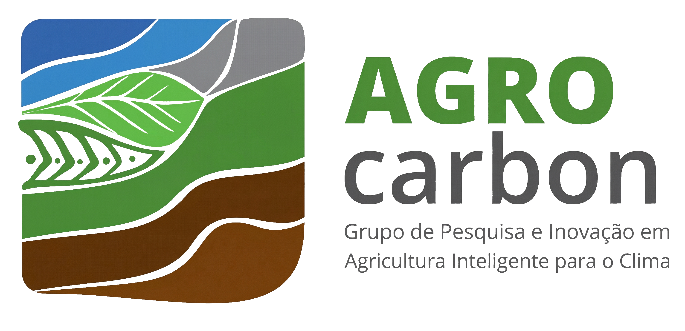
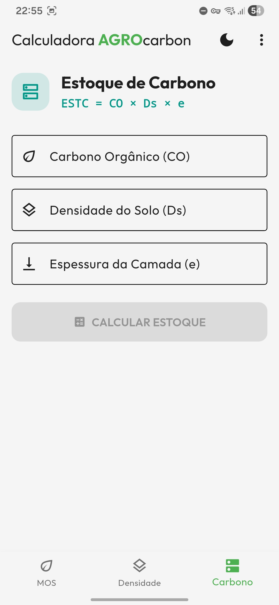
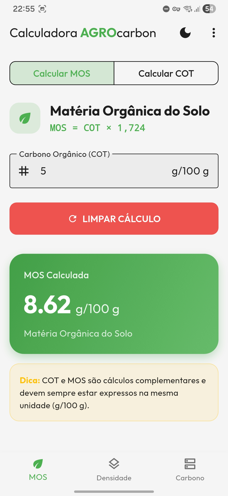
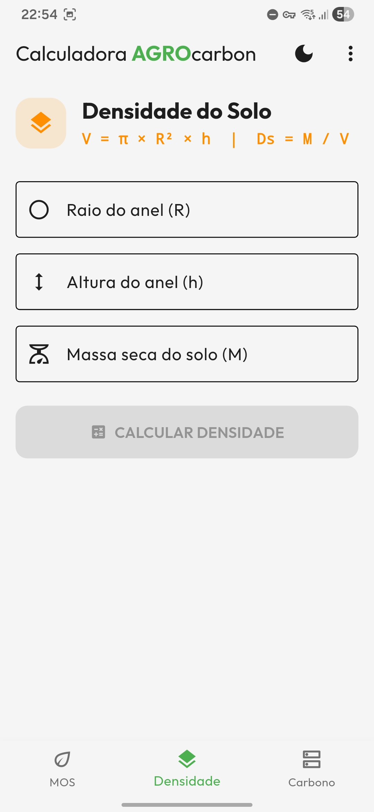
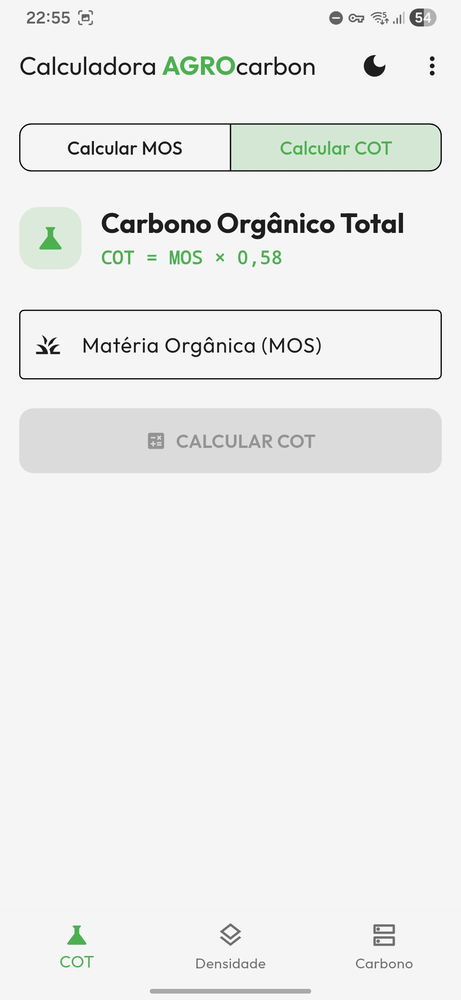

# 🌱 Calculadora AgroCarbon

<p align="center">
  
</p>

A **Calculadora AgroCarbon** é uma ferramenta open-source desenvolvida em Flutter para quantificar o **Estoque de Carbono no Solo (ESTC)** em áreas agrícolas. O aplicativo converte dados laboratoriais e de campo em informações estratégicas de forma simples, rápida e padronizada — auxiliando produtores, consultores, pesquisadores e agentes do mercado de carbono.

---

## 📌 Índice

1. [Sobre o App](#sobre-o-app)
2. [Propósito e Funcionalidades](#propósito-e-funcionalidades)
3. [Fórmulas e Metodologia](#fórmulas-e-metodologia)
4. [Instalação e Execução (Passo a passo)](#instalação-e-execução-passo-a-passo)
5. [Dependências e Ferramentas](#dependências-e-ferramentas)
6. [Estrutura do Projeto](#estrutura-do-projeto)
7. [Screenshots](#screenshots)
8. [Equipe / Grupo AGROcarbon](#equipe--grupo-agrocarbon)

---

## 🧾 Sobre o App

A Calculadora AgroCarbon foi desenvolvida para executar os principais cálculos relacionados ao estoque de carbono no solo com base em fórmulas oficiais e práticas consagradas em pesquisas agronômicas. O app permite entrada de dados laboratoriais (massa seca, MOS, dimensões de amostra, etc.) e devolve resultados padronizados como COT e ESTC.

---

## 🎯 Propósito e Funcionalidades

**Propósito central:** apoiar a mensuração e padronização do Estoque de Carbono no Solo (ESTC) para aplicações como créditos de carbono, programas de agricultura regenerativa e certificações ambientais.

**Funcionalidades principais:**

* Inserção de dados laboratoriais e de campo (massa seca, volume da amostra, espessura da camada, MOS etc.).
* Cálculo automático de: MOS, COT, Densidade do Solo (Ds) e ESTC (kg/m²).
* Interface simples e objetiva para uso em campo e em relatórios técnicos.
* Exportação/Registro básico de resultados (dependendo da implementação atual).

> **Frase-chave:** "Valorizar a terra, tornando o estoque de carbono um ativo comercial."

---

## 🧮 Fórmulas e Metodologia

### 1. Matéria Orgânica do Solo (MOS)

```
MOS = COT × 1,724
COT = MOS × 0,58
```

### 2. Densidade do Solo (Ds)

```
V = π × R² × h
Ds = Ms / V
```

(Ms = massa seca da amostra; V = volume da amostra calculado pela geometria apropriada)

### 3. Estoque de Carbono no Solo (ESTC)

```
ESTC = COT × Ds × e / 10
```

(onde `e` é a espessura da camada analisada; o divisor 10 ajusta unidades para kg/m² conforme a metodologia adotada)

---

## 💻 Instalação e Execução (Passo a passo)

### Pré-requisitos

* Flutter SDK (versão estável recomendada). Guia de instalação: [https://docs.flutter.dev/get-started/install](https://docs.flutter.dev/get-started/install)
* IDE: Android Studio, Visual Studio Code ou IntelliJ IDEA
* SDKs de plataforma (Android/iOS) configurados conforme documentação do Flutter

### Clonar o repositório

```bash
git clone https://github.com/seu-usuario/calculadora-agrocarbon.git
cd calculadora_agrocarbon
```

> Substitua `seu-usuario` e `calculadora-agrocarbon` pelo path real do repositório.

### Instalar dependências

```bash
flutter pub get
```

### Gerar arquivos do MobX (se aplicável)

Como o projeto utiliza `mobx_codegen`, é necessário gerar os arquivos `.g.dart` com `build_runner`:

```bash
dart run build_runner build --delete-conflicting-outputs
```

> Se preferir observar arquivos sendo gerados continuamente durante o desenvolvimento, use `watch` em vez de `build`.

### Executar o aplicativo

```bash
flutter run
```

Ou abra o projeto na sua IDE (Android Studio / VS Code) e execute pelo gerenciador de dispositivos/debug.

---

## 📦 Dependências e Ferramentas (principais)

Este projeto foi desenvolvido com foco em escalabilidade e manutenção. Abaixo estão as dependências e ferramentas mencionadas:

### Gerenciamento de Estado

* `mobx` e `mobx_codegen` (geração de stores com codegen)
* `build_runner` (geração dos arquivos .g.dart)

### Arquitetura e Injeção de Dependência

* `flutter_modular`

### Armazenamento Local

* `shared_preferences`

### UI & Animações

* `animations` (flutter/animations)
* `font_awesome_flutter`
* `google_fonts` (Fonte: *Outfit*)

### Ferramentas auxiliares

* `flutter_native_splash` (tela de splash nativa)
* `flutter_launcher_icons` (geração de ícones)

---

## 🗂️ Estrutura do Projeto (resumo)

```
lib/
├── app/
│   ├── core/
│   │   ├── components/
│   │   ├── theme/
│   │   └── core_module.dart
│   ├── modules/
│   │   ├── carbon/
│   │   ├── density/
│   │   ├── home/
│   │   └── mos/
│   ├── app_module.dart
│   └── app_widget.dart
└── main.dart
```
---

## 📸 Screenshots

<table>
  <tr>
    <td></td>
    <td></td>
    <td></td>
    <td></td>
  </tr>
</table>

---

## 👥 Equipe: Grupo AGROcarbon

**Coordenador:**

* Prof. Dr. Gustavo André de Araújo Santos — Universidade Federal do Maranhão (Chapadinha/MA)

**Grupo AGROcarbon** — Laboratório Inteligente de Pesquisas destinadas a Mudanças Climáticas e Agricultura

**Compromissos do grupo:**

* Pesquisa científica de alto nível
* Desenvolvimento de soluções práticas para o campo
* Apoio a práticas agrícolas regenerativas
* Formação e capacitação de profissionais
* Valorização da diversidade e inclusão

---

Desenvolvido por **Rodrigo Salgado** — para um futuro mais sustentável.
